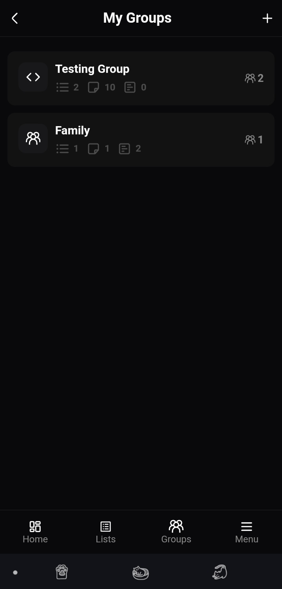
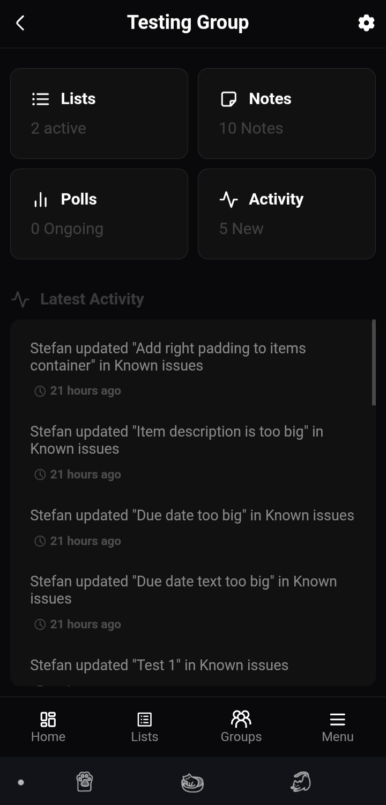
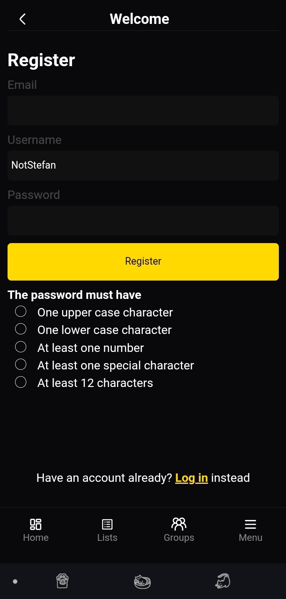
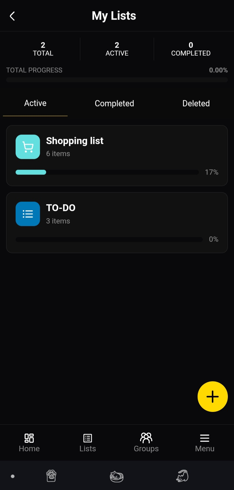
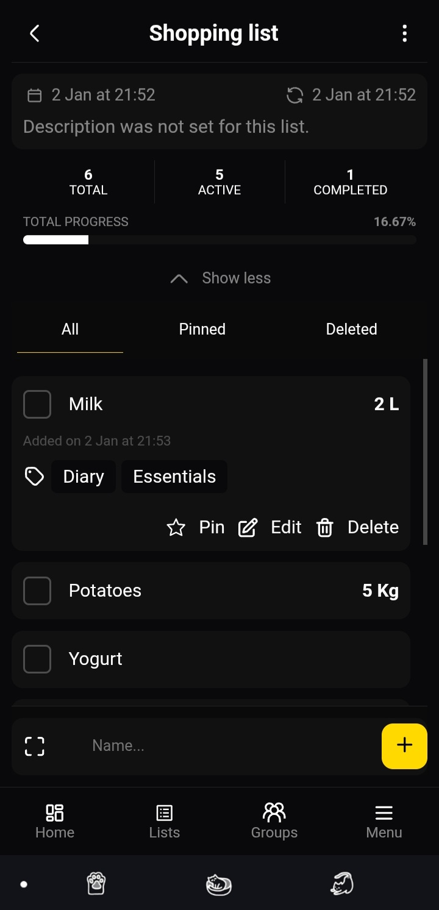
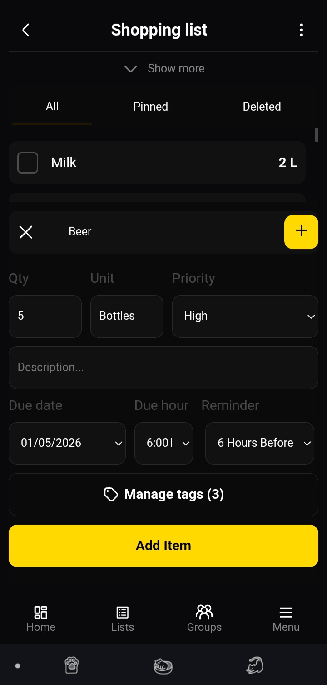
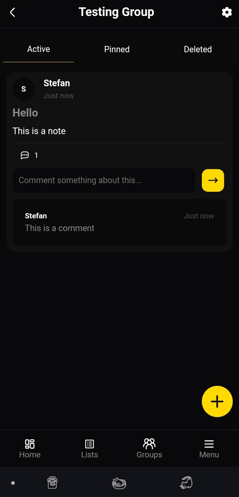
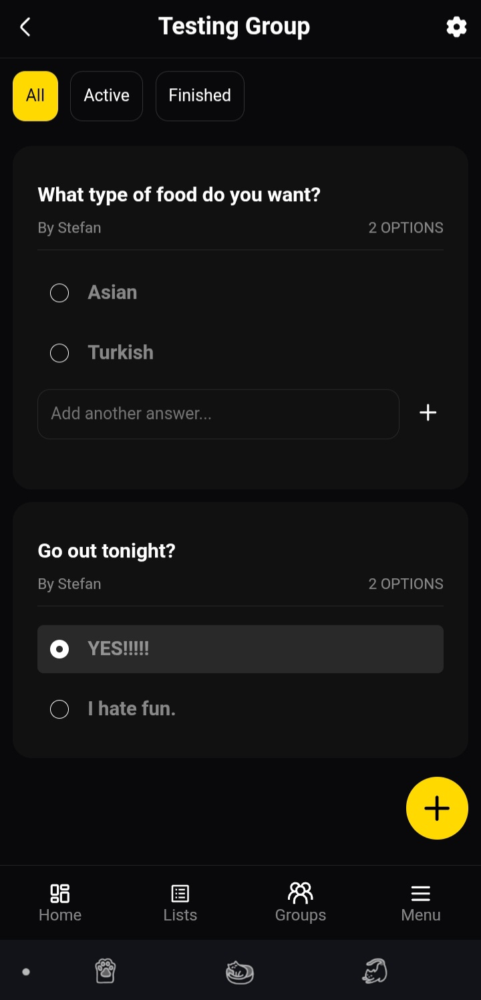
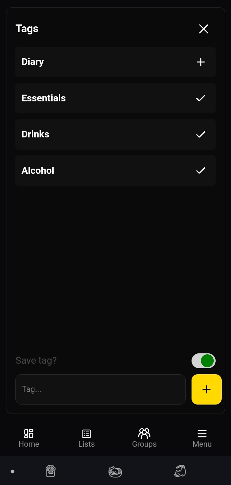
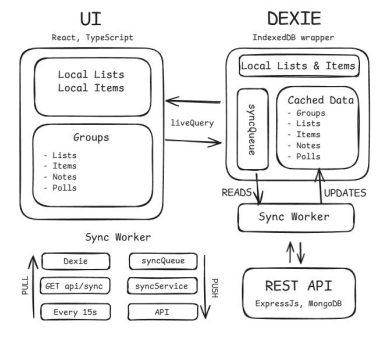

# Acta — Hybrid Workspace & Productivity Engine

 


A powerful hybrid productivity app designed to function seamlessly as a lightning-fast, offline personal tool while offering robust, cloud-based group collaboration. Manage lists, coordinate projects, and make group decisions with zero friction.

**[🔗 View Live Demo](https://stefan0712.github.io/acta)** | **[📂 Backend Repository](https://github.com/Stefan0712/acta-api)**

<p align="center">
  
  
  
  
  
</p>

---

## 🏗️ Architecture & Sync Engine

Acta is built on a "Local-First" philosophy. It utilizes a custom sync engine that bridges local browser storage with a cloud database, ensuring the app is always fast and always available.


* **Local-First (Dexie.js):** All data is immediately written to IndexedDB for zero-latency interactions. The app works flawlessly without an account or internet connection.
* **Cloud Collaboration (Node.js/MongoDB):** When users authenticate and join groups, the app synchronizes local data with the Express REST API, handling conflict resolution and real-time updates across multiple clients.

---

## ✨ Key Features

### 1. Shared Workspaces & Access Control
Built a comprehensive group system allowing users to coordinate projects, household chores, or team tasks effectively.
* **Granular Permissions:** Role-based access (Owner, Admin, Member) to strictly control content modification and deletion.
* **Activity Tracking:** Detailed history logs to audit exactly who changed what within the group.

<table width="100%">
  <tr>
    <td width="33%" align="center"><b>Group Dashboard</b></td>
    <td width="33%" align="center"><b>Member Management</b></td>
    <td width="33%" align="center"><b>Authentication</b></td>
  </tr>
  <tr>
    <td></td>
    <td></td>
    <td></td>
  </tr>
</table>

### 2. Smart Lists & Task Delegation
* **Real-Time Assignments:** Claim items for yourself or assign tasks directly to specific group members.
* **Instant Portability:** Users can export local lists to JSON and import them back at any time, ensuring total data ownership.

<table width="100%">
  <tr>
    <td width="33%" align="center"><b>Personal Lists</b></td>
    <td width="33%" align="center"><b>Shared Tasks</b></td>
    <td width="33%" align="center"><b>Task Creation</b></td>
  </tr>
  <tr>
    <td></td>
    <td></td>
    <td></td>
  </tr>
</table>

### 3. Collaborative Decision Tools
Integrated tools designed to help groups discuss details and reach consensus in one centralized location.
* **Dynamic Polls:** Create voting polls with fixed options or allow members to add their own live suggestions.
* **Threaded Notes:** Write long-form notes equipped with threaded comments for deep-dive discussions.

<table width="100%">
  <tr>
    <td width="33%" align="center"><b>Threaded Notes</b></td>
    <td width="33%" align="center"><b>Voting Polls</b></td>
    <td width="33%" align="center"><b>Tagging System</b></td>
  </tr>
  <tr>
    <td></td>
    <td></td>
    <td></td>
  </tr>
</table>

---

## 🛠️ Tech Stack

* **Frontend:** React 19, TypeScript, Vite, React Router v7
* **Backend:** Node.js, Express, TypeScript
* **Database (Cloud):** MongoDB (Mongoose)
* **Database (Local):** Dexie.js (IndexedDB wrapper for offline-first storage)
* **Utilities:** BSON (Unique ID generation for syncing), `vite-plugin-svgr` (Custom SVG handling), Lucide-React

---
## 🏗️ Architecture & Offline-First Sync Engine

Acta is built on a "Local-First" philosophy. To ensure zero-latency interactions and offline availability, the app utilizes a custom sync engine that bridges local browser storage with a cloud database.

<p align="center">
  
</p>

### How the Sync Engine Works

* **Optimistic Reactivity (`liveQuery`):** The React UI doesn't wait for network responses. It directly observes the local **Dexie.js (IndexedDB)** database using `liveQuery`. All user actions are instantly written locally and immediately reflected on the screen.
* **The Sync Queue (Push):** When a user modifies shared group data, the mutation is stored in a local `syncQueue`. A background **Sync Worker** continuously processes this queue, pushing local changes to the Express/MongoDB REST API.
* **Periodic Polling (Pull):** To keep group collaboration seamless, the Sync Worker polls the backend (`GET api/sync`) every 15 seconds. It fetches any remote changes made by other users and seamlessly merges them into the local Dexie cache without blocking the main UI thread.

## 🚀 Roadmap

Acta is actively being polished. Upcoming technical features include:

* **Optimistic UI Caching:** Background fetching to view and interact with cloud data seamlessly during network drops.
* **Delta-Syncing & Conflict Resolution:** Smarter merging algorithms when two users edit the exact same list while offline.
* **Advanced Admin Tools:** Enhanced group management including user kicking, role demotion, and history scrubbing.
* **PWA Notifications:** Utilizing service workers for local alerts regarding new assignments and poll results.

---

## 📱 Progressive Web App (PWA) Install

Acta is fully optimized as a PWA for a native mobile experience.

* **iOS (Safari):** Tap `Share` > `Add to Home Screen`.
* **Android (Chrome):** Tap the `Menu (⋮)` > `Install App` or `Add to Home Screen`.

---

## 💻 Local Development

*Note: The API is online most of the time, but 100% uptime is not guaranteed during active development.*

1. Clone the repository

   ```bash
   git clone https://github.com/Stefan0712/acta.git
   ```
2. Install dependencies

   ```bash
   npm install
   ```
3. Start the development server
   ```bash
   npm run dev
   ```

   
## 👤 Author
Stefan Vladulescu

Portfolio: stefanvladulescu.com

Contact: contact@stefanvladulescu.com

📄 License
This project is licensed under the MIT License - see the LICENSE file for details.
